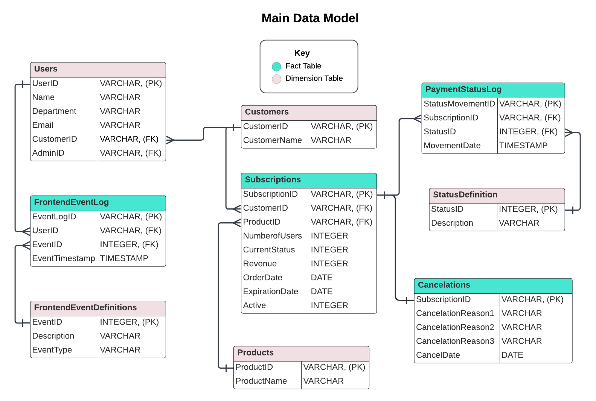
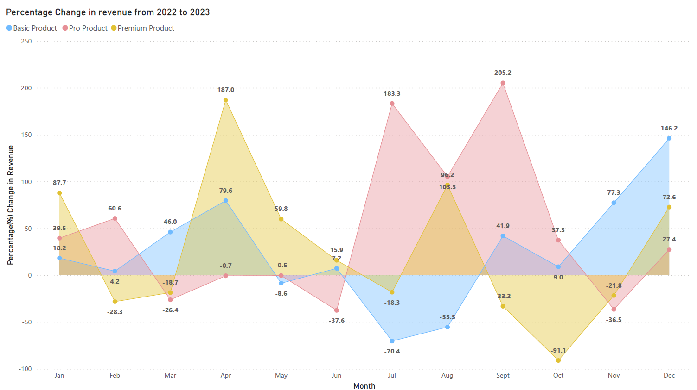

# CloudFlow Revenue and Retention Optimization Project 
## 📆Business Objective
CloudFlow aims to **maximize recurring revenue and customer retention** by identifying key factors influencing subscription growth and churn. This project leverages data-driven insights to **optimize revenue streams** (via better product uptake and upsells) and **improve retention** (by addressing churn causes and engagement gaps). These findings will inform strategic initiatives that boost customer lifetime value and reduce churn rate.

## 🏢Company Background
CloudFlow is a **subscription-based B2B SaaS company** offering cloud solutions through a tiered plan model (Basic, Pro, Premium). Its clients range from small teams to large enterprises, paying monthly or annually. Revenue primarily comes from recurring subscriptions and expansion within existing accounts. Success in this model hinges on high customer satisfaction and perceived product value.

## 🔍Project Purpose
This analysis focuses on answering three core business questions:

*Where are we gaining or losing revenue?*

*Why do customers churn, and how can we prevent it?*

*Where do users encounter friction in the product or sales funnel?*

To address these, we examined product usage, revenue data, engagement patterns, support interactions, and conversion funnel behaviour.

## Dataset Structure
The dataset consists of nine tables, covering information about users, customers, subscriptions, products, and frontend activity, as well as payment status changes and cancellations. The dataset can be found [here](assets/dataset). The analysis is carried out using mySQL Workbench 8.0 and the script can be found [here](assets/Cloudflow_Script.sql).

## 📊Core Analysis Themes & Insights

# Revenue Trends and Product Performance
**Focus:** Evaluate revenue by subscription tier and identify growth/volatility trends

**Guiding Questions**

*How does revenue break down by subscription tier (Basic, Pro, Premium), and which tier drives the most revenue?*

*What are the trends in monthly revenue over 2022–2023?*

**Key Insights**

- **Premium** plan has the highest average revenue per month (£275.15k), followed by **Basic** (£246.94k) and **Pro** (£207.10k). The SQL output can be found [here](assets/Output/1a.pdf).

- **Basic** has the highest revenue fluctuation (£74.5k std. dev), suggesting sensitivity to churn or seasonal campaigns. The SQL output can be found [here](assets/Output/1a.pdf).

**Revenue Change Summary (Y-o-Y):** 
1. Highly Volatile Mid-Year
   - Revenue trends experienced substantial swings between June and August
   - Basic product saw sharp declines in July and August (-70.4% and -55.5%)
   - Pro and Premium products spiked dramatically during the same period

2. Strong Finish to the Year
   - Basic rebounded in November (+77.3%) and December (+146.2%)
   - Premium regained momentum with +72.6% in December

3. Surging Peaks in Late Q3
   - Pro revenue surged in July (+183.3%) and September (+205.2%)

4. Extreme Fluctuations in Premium Product
   Premium spiked in April (+187.0%) then dropped steeply in October (-91.1%)

The table for the Power BI dashboard below can be found [here](assets/Output/1b.pdf).

**Quarterly Revenue Trend**

| Quarter  | Key Highlights: 2022 | Key Highlights: 2022 |
| ------------- | ------------- | ----------------------- |
| Q1 | Moderate gains after initial growth  | Strong start, then slight declines  |
| Q2  | Large dip followed by a strong rebound  | Heavy loss in May, major rebound in June  |
| Q3  | Inconsistent with declining trend  | Mixed results, stronger August  |
| Q4  | Huge spike in October, major dip in November  | Gradual rise toward a record December  |

**Summary:** 2022 ([<u>Revenue Chart</u>](assets/Power_BI_PDFs/2022_Revenue.png)) was a rollercoaster year with extreme highs/lows, while 2023 ([<u>Revenue Chart</u>](assets/Power_BI_PDFs/2023_Revenue.png)) showed more resilience—especially in Q1 and Q4. Q4 is strategically important in both years.

## Customer Engagement and Support
**Focus:** Measure user activity and support reliance to identify engagement gaps

**Guiding Questions**

*How actively are users engaging with CloudFlow (e.g. clicking links or using features)? Is the engagement distributed evenly or are there many low-activity users?*

*To what extent do users rely on self-service support (help center, FAQs) versus contacting support or filing tickets? Are support resources effectively helping users, or do many issues escalate to support tickets?*

**Key Insights:**

- **Majority of users** are moderately active: 33.9% clicked 2–3 links; 18.6% clicked 4 links. Only **3.4% of users** are high-frequency clickers (9–10 links), signalling a drop-off in "power users." The SQL output can be found [here](assets/Output/2.pdf). 

- Support behaviour ([<u>SQL output</u>](assets/Output/5.pdf))
   - Some users escalate directly to tickets without viewing help content
   - Only ~25% interact with help/FAQ content before filing tickets

## Funnel Conversion Analysis
**Focus:** Identify drop-off points and friction in the upgrade/payment process

**Guiding Questions**

*At which stage of the payment or onboarding funnel do we lose the most prospects?*

*How efficient is the funnel in terms of time – are users spending too long at certain steps or abandoning quickly?*

**Key Insights:**

- Of those who open the payment widget, only ~39% complete the transaction The SQL output can be found [here](assets/Output/3.pdf).

- Errors (form inputs or vendor processing) outnumber successful completions (180 errors vs. 72 successes). The SQL output can be found [here](assets/Output/8a.pdf).

- Time Spent in Payment Funnel (The SQL output can be found [here](assets/Output/8b.pdf))
  - Early stages (0–1):Avg. 8+ minutes, suggesting high abandonment rates ([Excel Output](assets/Excel_Output/Avg_time_spent.png))
  - Cumulative time for completion: Avg. 25–29 mins with 12 min minimum, suggesting lengthy checkout process ([Excel Output](assets/Excel_Output/Diff_in_Mins.png))

## Retention and Expansion Opportunities
**Focus:** Understand churn drivers and upsell opportunities

**Guiding Questions**

*What are the primary reasons customers are cancelling or not renewing? Is pricing a major concern?*

*How many customers have potential for upselling (e.g., have only one product or a lower tier plan) and thus represent low-hanging fruit for revenue expansion?*

**Key Insights:**

- ~35% of churned users cite price sensitivity as their main reason for leaving. The SQL output can be found [here](assets/Output/6.pdf).

- 122 accounts flagged for upsell opportunities — many are large clients using only one product/module. The SQL output can be found [here](assets/Output/4a.pdf) and [here](assets/Output/4b.pdf).

## 📈Core Analysis Themes & Insights
1. ⬆️ **Upsell High-Potential Accounts**
Launch targeted campaigns for 122 identified accounts (esp. large single-module clients) to boost account value and product adoption.

2. ⚖️ **Funnel Optimization for Conversion**
Streamline the checkout funnel by simplifying UI and resolving common errors; only ~39% of users complete after initiating checkout.

3. 💸 **Flexible Pricing & Value Communication**
Introduce pricing tiers or dynamic offers and reinforce product value to reduce price-related churn (~35%).

