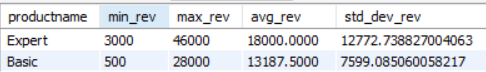
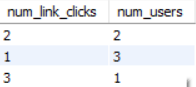

# CloudFlow Revenue and Retention Optimization Project 
## Business Objective
CloudFlow aims to **maximize recurring revenue and customer retention** by identifying key factors influencing subscription growth and churn. The objective of this project is to leverage data-driven insights to **optimize revenue streams** (through better product uptake and upsells) and **improve customer retention** (by addressing churn causes and engagement gaps). This will guide strategic initiatives to increase customer lifetime value and reduce churn rate.

## Company Background
CloudFlow is a **subscription-based SaaS company** offering cloud solutions on a tiered plan model (e.g. Basic, Pro, Premium). As a B2B-focused platform, CloudFlow serves organizations of varying sizes – from small teams to enterprise clients – on monthly or annual subscriptions. The company’s revenue model relies on **recurring subscription fees** and expansion within accounts (upselling additional product modules or higher-tier plans). Maintaining high customer satisfaction and continual product value is critical in **driving renewals and upgrades** in this SaaS model.

## Project Purpose
The purpose of the Revenue and Retention Optimization project is to **analyze CloudFlow’s usage, financial, and customer interaction data** to uncover actionable insights. By examining subscription revenues, user engagement patterns, support interactions, and conversion funnels, the project addresses key business questions:

*Where are we gaining or losing revenue?*

*Why do customers churn, and how can we prevent it?*

*Where do users encounter friction in the product or sales funnel?*

The analysis of these data points will help CloudFlow develop targeted strategies across product, marketing, engineering, and customer success teams to **boost revenue growth and improve retention.**

The dataset can be found [here](assets/BP1/tc.zip).

## Core Analysis and Scope
The analysis is organized into four thematic areas, each corresponding to a set of insights drawn from the data. For each theme, we outline the focus, key questions addressed, and relevant metrics (with findings) from the data.

## Revenue Trends and Product Performance
**Focus:** Evaluate how different products (subscription tiers) contribute to revenue and assess revenue trends over time.

**Key Questions:**

- How does revenue break down by subscription tier (Basic, Pro, Premium), and which tier drives the most revenue?

- What are the trends in monthly revenue over 2022–2023? (Are there seasonal spikes or declines, and how does year-over-year growth look?)

**Metrics & Findings:**

- **Revenue by Product Tier:** CloudFlow’s Premium plan generates the highest average monthly revenue per period ($275.15k), followed by the Basic plan ($246.94k) and Pro (~$207.10k). Notably, the Basic tier, despite a lower price point, contributes significantly – indicating a large volume of Basic subscribers. The Basic plan also showed the highest revenue variability (std. dev. ≈ $74.5k) compared to Pro and Premium, suggesting Basic-tier revenue fluctuates more (possibly due to upgrades or churn in a big user base).

- **Year-over-Year Growth:** Overall subscription revenues have grown year-over-year. For example, Basic plan revenue in January increased from $111,900 in 2022 to $132,300 in 2023 (18% growth), and Pro plan grew from $112,900 to $157,500 in the same period【10†】. However, there were exceptions: in February, Premium plan revenue dropped from $165,000 (2022) to $118,300 (2023)【10†】, indicating some churn or downgrade in that segment. Such month-by-month comparison helps pinpoint when certain tiers underperformed.

- **Monthly Revenue Trend:** The monthly total revenue trend (all products combined) showed **significant fluctuations** over the two-year period. For instance, after peaking at $502,800 in Oct 2022, revenue fell sharply by -$172,300 in Nov 2022. 2023 saw a substantial slump in May 2023 (-$204,600 from April), followed by a strong recovery and a **record high** in Dec 2023 (approx. $534,300, a $254.5k increase from Nov). These swings suggest seasonal factors or campaign impacts (e.g., possibly a mid-year drop and a year-end push). Identifying the causes behind the **largest dip (May 2023)** and the **big surge (Dec 2023)** will be important for planning (e.g., smoothing out mid-year churn, replicating successful strategies from year-end).

## Customer Engagement and Support
**Focus:** Understand user engagement with CloudFlow’s features and their usage of support resources, to gauge overall activity levels and potential friction points requiring support.

**Key Questions:**

- How actively are users engaging with CloudFlow (e.g. clicking links or using features)? Is the engagement distributed evenly or are there many low-activity users?

- To what extent do users rely on self-service support (help center, FAQs) versus contacting support or filing tickets? Are support resources effectively helping users, or do many issues escalate to support tickets?

**Metrics & Findings:**

- **User Engagement Distribution:** Engagement analysis (measured here by number of link clicks per user) shows a skewed distribution. A majority of users perform a **moderate number of clicks** in the application, while a smaller group are highly active. For example, about 18.6% of users clicked 4 links in the period analyzed, the largest single group. Around one-third of users (33.9%) clicked 2–3 links, whereas very few users (≈3.4%) clicked 9 or 10 links. This indicates a **drop-off in ultra-engaged users**, suggesting that while typical users do interact with the product, relatively few are power-users. There may be an opportunity to increase engagement (moving users from 1–2 clicks to higher interaction levels) through in-app guides or marketing, as higher engagement often correlates with retention.

- **Support Self-Service vs Tickets:** There is evidence that many users do **not fully utilize self-help resources** before reaching out to support. For instance, one user (ID U381) had **0** help center views or FAQ clicks but submitted **2 support tickets.** This pattern of immediate escalation to support suggests that some customers either can’t find answers in self-service or prefer direct support. On the other hand, some users successfully self-serve – e.g., user U827 viewed FAQs (recorded 1 FAQ click) and submitted **no tickets**, implying their issue was resolved via the knowledge base. Overall, the data shows a mix: a portion of the user base leverages documentation/FAQ (about 25% of the listed sample clicked at least one help article or FAQ) while a significant number proceed straight to support requests. This insight highlights the need to improve **documentation accessibility and effectiveness** to deflect avoidable support tickets (which can improve user satisfaction and reduce support costs).

## Conversion Funnel Analysis
**Focus:** Analyze the subscription signup and payment funnel to find where potential customers drop off during the upgrade/purchase process, and identify technical or UX issues hindering conversions.

**Key Questions:**

- At which stage of the payment or onboarding funnel do we lose the most prospects?

- What errors or issues are occurring during the payment process that prevent completion?

- How efficient is the funnel in terms of time – are users spending too long at certain steps or abandoning quickly?

**Metrics & Findings:**

- **Funnel Drop-Off Points:** The funnel data reveals **substantial drop-off at the very start and final stages of the payment process.** Out of all users who showed intent to subscribe, a large number **never initiated the payment** at all (180 users did not start the payment process). Among those who did start (opened the payment widget), many failed to complete: 87 opened the payment page, but only 78 proceeded to enter payment details, and ultimately only 54 submitted their payment. The conversion from payment start to a successful transaction was only ~39% (34 successes out of 87 starts), indicating significant leakage. The biggest drop-offs occurred when users attempted to submit payment info – at least 34 instances of **user input errors** were recorded (e.g. validation errors) and 38 instances of **payment processing errors** from the payment vendor side disrupted transactions. These errors collectively outnumber successful payments (only 34 successes), which is alarming for revenue conversion.

- **Error Impact:** An aggregated view of final outcomes shows **error states far exceed completions.** There were 180 total error events counted vs. 72 successful payment completions in the funnel analysis. This means users are more likely to encounter an error than a smooth checkout, which drastically hurts conversion rates. The errors include both user-side issues (possibly form errors or declines) and system issues (payment processing failures), underscoring a need for improvements on both fronts.

- **Time Spent in Funnel:** Timing data suggests that users who abandon at early stages do so quickly. Many users who quit at the **PaymentWidgetOpened** stage spent on average only ~14 seconds on the payment page before giving up【25†】. This short duration implies confusion or frustration – they might not have found what they expected or encountered a blocker almost immediately (e.g., an unintuitive form or a technical glitch). Conversely, if we examine those who ended in an “Error” state, some records show NULL times (likely indicating no meaningful progress before error)【25†】. Overall, the funnel analysis indicates **urgent opportunities to streamline the payment process** (simplify the checkout UI, guide users to avoid input errors, and fix backend issues to reduce processing failures). Even small improvements here could convert dozens of additional customers, given the high drop-off counts.

## Retention and Expansion Opportunities
**Focus:** Investigate why customers churn (non-renew or downgrade) and identify opportunities to increase revenue from existing customers via upsells or cross-sells.

**Key Questions:**

- What are the primary reasons customers are canceling or not renewing? Is pricing a major concern?

- How many customers have potential for upselling (e.g., have only one product or a lower tier plan) and thus represent low-hanging fruit for revenue expansion?

- Which segments of the customer base should account management prioritize for retention and expansion efforts?

**Metrics & Findings:**

- **Churn Drivers-Price Sensitivity:** Customer feedback and cancellation reasons point to **pricing (“product is too expensive”) as a significant factor in churn.** In a recent period, roughly **34–37% of churned customers cited cost** as a reason for leaving. This proportion, while gradually declining (from 37% to 34% over the observed timeframe), remains the single largest cited reason. It indicates that over one-third of departing customers feel they are not receiving enough value for the price. Other reasons (not detailed in the snippet) make up the remaining ~63–66%, likely including product fit, missing features, support issues, etc. The high rate of price-related churn suggests CloudFlow may need to **re-evaluate its pricing strategy or better communicate value** – especially to cost-sensitive clients or those on the fence about renewal.

- **Upsell Potential:** There is a clear opportunity to **increase revenue from the existing customer base via upselling** additional products/modules. Analysis shows **122 customer accounts have upsell opportunities** identified – these are clients who have only a subset of CloudFlow’s product offerings. Many of these are sizable accounts. For example, one enterprise customer (ID anonymized) with over 6,700 users in their organization is subscribed to only one CloudFlow product【28†】, flagging a strong upsell case to add more modules or upgrade their plan. By targeting such single-product customers (especially those on the Basic tier or using only one module), CloudFlow can not only boost revenue per account but also deepen the customer’s reliance on the platform (which in turn improves retention). The data suggests a number of large clients fall in this category, making it a high-impact focus area for the sales and customer success teams.

- **Retention Segmentation:** Combining the insights above, we can segment the customer base to prioritize retention efforts. For instance, clients who indicate price concerns and have low product adoption (e.g., only one module, or low engagement as seen in support/engagement metrics) are at higher risk of churn and prime candidates for outreach. Meanwhile, satisfied single-product customers represent expansion opportunities. This analysis helps **inform cross-functional teams on where to focus – e.g., Customer Success can focus on value realization for price-sensitive accounts, and Sales can focus on upsell pitches to single-product accounts.**

## Strategic Recommendations

Based on the comprehensive SQL analysis and findings (Revenue Trends, Customer Engagement, Conversion Funnel, and Retention/Upsell Opportunities), CloudFlow should pursue the following key initiatives. These strategic recommendations integrate tactical actions (product fixes, campaign ideas, process improvements) and are prioritized by expected impact and feasibility:

1. **Optimize the Conversion Funnel and Onboarding Process:** Remove friction at critical stages of the user journey to increase conversion from free trials to paid subscriptions. CloudFlow should streamline the sign-up and onboarding experience:
     1. **Simplify User Registration:** Reduce the steps required to create an account (for example, implement single sign-on or shorter forms) to lower drop-off rates during sign-up. The analysis indicates significant user drop-off during registration, so a smoother process will capture more prospects.
     2. **Implement Guided Onboarding:** Introduce in-app tutorials, setup wizards, or onboarding emails that quickly demonstrate CloudFlow’s core value. Guiding new users to reach key milestones in their first sessions will improve initial engagement and encourage trial users to convert to paying customers.
     3. **Engage Inactive Trial Users:** Deploy a mid-trial outreach campaign (e.g. personalized emails or support calls) for users who sign up but become inactive. Proactively offering assistance or incentives before their trial ends can re-engage these users and boost conversion rates.

*(Strategic Priority: High impact, relatively quick wins – improving funnel conversion directly drives revenue growth.)*

1. Main Point
     1. Main Point 1
     2. Main Point 2

